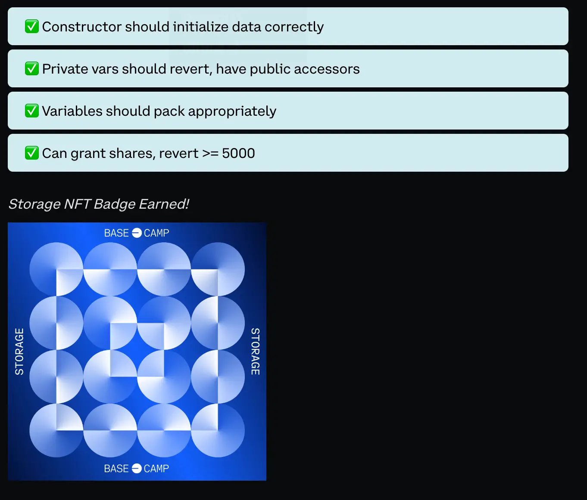

# BaseCamp


# Introdcution
TuringComplete - means that any program that can be represented in code can theoretically be expressed and executed on the network

The Limitations of Web2
- Privacy & Control:
- Censorship
- Lack of transparency
- Security vulnerabilities
- Limited interoperability

The limitatoins of Web3:
- Speed
- Storage
- Smart contract limitations
- All data is public


# EVM


- World State: Represents the entire Ethereum network, including all accounts and their associated storage.
- Accounts: Entities that interact with the Ethereum network, including Externally Owned Accounts (EOAs) and Contract Accounts.
- Storage: A key-value store associated with each contract account, containing the contract's state and data.
- Execution Stack: A last-in, first-out (LIFO) data structure for temporarily storing values during opcode execution.  Used for **holding function arguments, local variables, and intermediate values during function execution**

- Memory: A runtime memory used by smart contracts during execution.
- Program Counter: A register that keeps track of the position of the next opcode to be executed.


the EVM runs the smart contract, it modifies the blockchain's world state and consumes gas accordingly. However, if the transaction is found to be invalid, it will be dismissed by the network without further processing.


Some common opcodes include:
ADD: Adds two values from the stack.
SUB: Subtracts two values from the stack.
MSTORE: Stores a value in memory.
SSTORE: Stores a value in contract storage.
CALL: Calls another contract or sends ether.

## Gas

1 WEI = 10^-18 ETH
1 GWEI = 10^-9 ETH

### Memory types

#### Stack
For example, an opcode that performs an addition operation might push the two operands onto the stack, perform the addition, and then pop the result off the top of the stack.

#### Memory


#### Contract storage


# Smart-Contract development

## Tools
- hardhat.org
- getwaffle.io
- truffletsuite.com

- remix.ethereum.org

## Limits
### Gas
When you were learning about time complexity, you probably heard the term space complexity once, and then it was never mentioned again. This is because normally, computation is expensive, and storage is practically free. The opposite is true on the EVM. It costs a minimum of 20,000 gas to initialize a variable, and a minimum of 5,000 to change it. Meanwhile, the cost to add two numbers together is 3 gas. This means it is often much cheaper to repeatedly derive a value that is calculated from other values than it is to calculate it once and save it.

If the gas estimate is wrong, the transaction will fail, but it will still cost the gas used up until the point it failed!

### Size
EIP-170 introduced a compiled byte-code size limit of 24 kB to Ethereum Smart Contracts, that are approximately 300-500 lines of Solidity.

Can be bypassed by https://eips.ethereum.org/EIPS/eip-2535

### Stack
The EVM operates with a stack that can hold 1,024 values, but it can only access the top 16. "Stack to Deep" error because you're trying to work with too many variables at once.

In Solidity/EVM, your functions are limited to a total of 16 variables that are input, output, or initialized by the function.


## Language limitations

```solidity
// Bad code example: Does not work
function Greeter(string memory _name) external pure returns (string memory) {
    return "Hello " + _name + "!";
}
```
> TypeError: Operator + not compatible with types literal_string "Hello " and string memory.

You might think that there is some sort of type casting or conversion error that could be solved by explicitly casting the string literal to string memory, or vice versa. This is a great instinct. Solidity is a very explicit language.


## Types

- `uint256` to `int8` casting
```
uint256 first = 1;
int8 second = int8(int256(first));
```
- `type(uint).max`
- Smaller sized integers are used to optimize gas usage in storage operations, but there is a cost. The EVM operates with 256 bit words, so operations involving smaller data types must be cast first, which costs gas.
- `uint` is an alias for uint256 and can be considered the default.
- `address` = bytes20
- conversions from bytes20 and uint160 are allowed.
- `address`:: balance, transfer, call, staticall, delegatecall
- `string`:: concat,
- `enum` Flavors { Vanilla, Chocolate, Strawberry, Coffee }
- `constant`: file/contract level
- The `immutable` keyword is used to declare variables that are set once within the constructor, which are then never changed:
Flavors chosenFlavor = Flavors.Coffee;
- `pure`: unctions that promise not to read from or modify the state of the blockchain. That is, a pure function can't modify or even read variables from the contract's state.
- `view`: This is for functions that promise not to modify the state. view functions can read data from the contract's state, but they can't change state.
- The four types are `external`, `public`, `internal`, and `private`, and they control the visibility of functions to other contracts.


# Testnets
## L1
- Goerli: Launched in early 2019, Goerli initially utilized a multi-client proof-of-authority consensus model to improve stability and security. Following the Merge, it transitioned to a proof-of-stake consensus mechanism, maintaining its cross-client compatibility and making it an ideal choice for developers. Goerli's strong community support and collaboration, as the first community-driven testnet for Ethereum, contribute to ongoing maintenance, improvements, and feature enhancements, ensuring a robust testing environment for developers.

- Sepolia: As one of the two maintained primary testnets alongside Goerli, Sepolia is designed for developers seeking a lighter weight chain for faster synchronization and interaction. While Goerli is optimal for stakers and developers working with large existing states, Sepolia provides a more streamlined experience for testing and development.

## L2
- Base Goerli: As new Layer-2 networks emerged that settled on Ethereum's Layer-1, the need for testnets dedicated to these L2 networks also arose. For instance, the L2 network Base has its own testnet, known as Base Goerli. This testnet settles on the Ethereum Goerli L1 testnet, providing an environment for testing L2-specific features and smart contracts.

- Optimism Goerli: Optimism, an Ethereum Layer-2 scaling solution utilizing Optimistic Rollups, has its own testnet called Optimism Goerli. This testnet is built on the Ethereum Goerli L1 testnet and offers a testing environment for developers to experiment with Optimism's Layer-2 features, smart contracts, and dapps.

## Faucets
- https://faucet.quicknode.com/ethereum/goerli


- https://bwarelabs.com/faucets

## Deployment


[tx](https://goerli.basescan.org/tx/0xa97800186455d6d91ef474d2ffcb1dcfec5c9f9c47df913af9309184ac46ee80)


`0xB5990Cd4F9EEaE2E1a5Db3289A43cF6aB299373F`


# First Achivements


# Control Structures

```solidity
function condition(uint a, uint b) external pure returns (int) {
    for (uint i = 0; i < 0; i++) {
        console.log(i);
    }

    if (a > b) {
        return 1;
    } else if (a < b) {
        return -1;
    } else {
        return 0;
    }
}
```


### `require`, `revert`, `error`, `panic`
```solidity
function f1(uint a, uint b) public returns (bool) {
    require(a < 10 && a > 5 && b > 256 && b < 1024, "invalid range");
}
```

`error`, `revert` consume les gas

```solidity
error InvalidArgument();
function f2(uint a, uint b) public returns (bool) {
    revert();
    if (a > 256 || b > 256) {
        revert InvalidArgument();
    }
}

You'll also encounter revert used as a function, returning a string error. This legacy pattern has been retained to maintain compatibility with older contracts:
```solidity
function oldRevertAddEvenNumbers(uint _first, uint _second) public pure returns (uint) {
    if(_first % 2 != 0 || _second % 2 != 0) {
        // Legacy use of revert, do not use
        revert("One of the numbers is odd");
    }
    return _first + _second;
}
```


`type Panic(uint)` thrown by `assert(condition)`, selector `0x4e487b71`
`type Error(string)` thrown by `require(condition, message)`, selector `0x8c379a`


[0x612A80F000C6Dc07592029fC22963935b31975C6](https://goerli.basescan.org/address/0x612A80F000C6Dc07592029fC22963935b31975C6)


## Variable Packing


[0x8D0BCDD86577d6DA9F098941C29a84365a0978Db](https://goerli.basescan.org/address/0x8D0BCDD86577d6DA9F098941C29a84365a0978Db)



# Arrays

```solidity
contract StorageArray {
    // Variables declared at the class level are always `storage`
    uint[] arr = [1, 2, 3, 4, 5];

    function function_1() public {
        uint[] storage arr2 = arr;

        arr2[0] = 99; // <- arr is now [99, 2, 3, 4, 5];
    }

    function function_2(uint _num) public returns(uint[] memory) {
        arr_2.push(_num); // <- arr_2 is [1, 2, 3, 4, 5, <_num>]

        delete arr_2[2];  // <- arr_2 is [1, 2, 0, 4, 5, <_num>]

        arr_2.pop();  // <- arr_2 is [1, 2, 0, 4, 5] (_num IS NOT returned by.pop())

        delete arr_2; // <- arr_2 is []
        return arr_2; // <- returns []
    }
}
```

Operations
- `arr.push()`
- `arr.pop()`
- `delete arr[2]`
- `arr.length`

Type of arrays: storage, memory, and calldata
The storage, memory, or calldata keywords are required when declaring a new reference type variable

Storage is very expensive compared to most other environments. It costs a minimum of 20000 gas to store a value in a new storage slot, though it's cheaper to update that value after the initial assignment (~5000+ gas).

You **cannot use a storage array as a function parameter**, and you **cannot write a function that returns a storage array**.

Storage arrays are dynamic, unless they are declared with an explicit size

Arrays declared as **memory** are temporary and only exist within the scope in which they are created. Arrays in memory are not dynamic and **must be declared with a fixed size**.

```solidity
function declareMemoryArrays() public view {
    uint[5] memory simpleArr; // this line costs 135 gas
    uint[] memory emptyArr = new uint[](5); // This line costs 194 gas
    uint[] memory arrCopy = arr; // This line costs 13166 gas
}
```

**Arrays in calldata are read only.** Otherwise, they function the same as any other array.

Array slices are currently only implemented for calldata arrays.


[0x9DCc3a9aa840e5B962a9E359fC72FEa634808CF7](https://goerli.basescan.org/address/0x9DCc3a9aa840e5B962a9E359fC72FEa634808CF7)


## [Mappings](https://docs.base.org/base-camp/docs/mappings/mappings-sbs)
Limitations:
- Mappings can only have a data location of storage
- They can't be used as parameters or returns of public functions
- They are not iterable and you cannot retrieve a list of keys
- All possible keys will return the default value, unless another value has been stored


```solidity
mapping(string => bool) public approvedRecords;
mapping(address => mapping(string => bool)) userFavorites;
```

`0x99Ef1040d41a928e8a4C266a84DBCe0548842BE5`


## [Function Modifiers](https://docs.base.org/base-camp/docs/advanced-functions/function-modifiers)

```solidity
modifier onlyOwner {
    if (msg.sender != owner) {
        revert NotOwner(msg.sender);
    }
    _;
}
function iOwnThis() public view onlyOwner returns (string memory) {
    return "You own this!";
}
```

```solidity
error NotEven(uint number);

modifier onlyEven(uint _number) {
    if(_number % 2 != 0) {
        revert NotEven(_number);
    }
    _;
}

function halver(uint _number) public pure onlyEven(_number) returns (uint) {
    return _number / 2;
}
```

## [Structs](https://docs.base.org/base-camp/docs/structs/structs-sbs)
[Excercise](https://docs.base.org/base-camp/docs/structs/structs-exercise)
0x007f2EbFe8afd405616747bbcCed1aFe9de472a3


## [Inheritance](https://docs.base.org/base-camp/docs/inheritance/inheritance-sbs)

```solidity
contract ContractB {
    function whoAmI() external pure returns (string memory) {
        return "contract B";
    }
}

contract ContractA is ContractB {
}
```

You cannot call a private function from a contract that inherits from the contract containing that function.

### Multiple Inheritance
```solidity
contract ContractA is ContractB, ContractC {
    function whoAmI() external override(ContractB, ContractC) pure returns (string memory) {
        return ContractB.whoAmI();
    }
}
```

### Abstract contract
```solidity
abstract contract ContractD {
    function whoAreYou() public virtual view returns (string memory);
}
```
### Excercise
Salesperson 0xEA5d6816d135a770b222E40237E329c486301082
EngineeringManager 0xF18Fa4Afb6763809593ee5Dc8619410b4B40fFaC
InheritanceSubmission 0x2FBb3Db36a85644e1F3d92cB60B46974ef948Aa1

